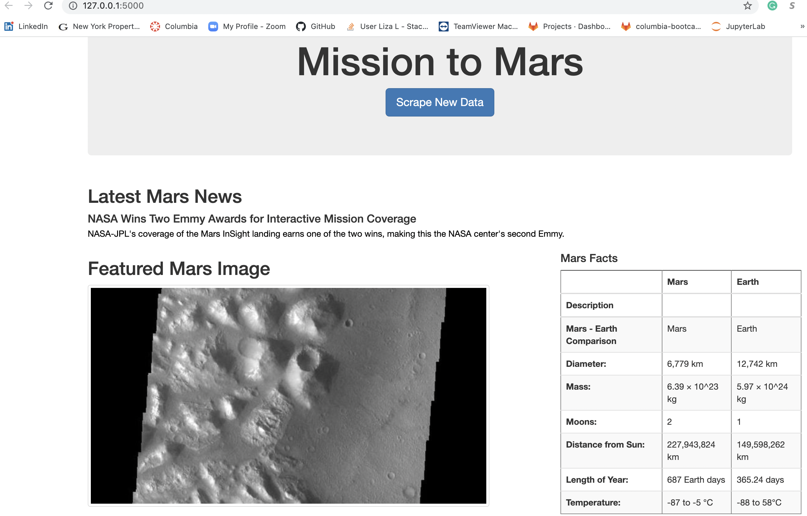

# Mission-to-Mars-

## Project Overview

The purpose of the project is to create a web application with Flask that will automatically scrape different websites to extract data about the Mission to Mars, store in a NoSQL database and display it on a HTML page.

## Results 

[Image2.png](Image2.png)

[Image3.png](Image3.png)