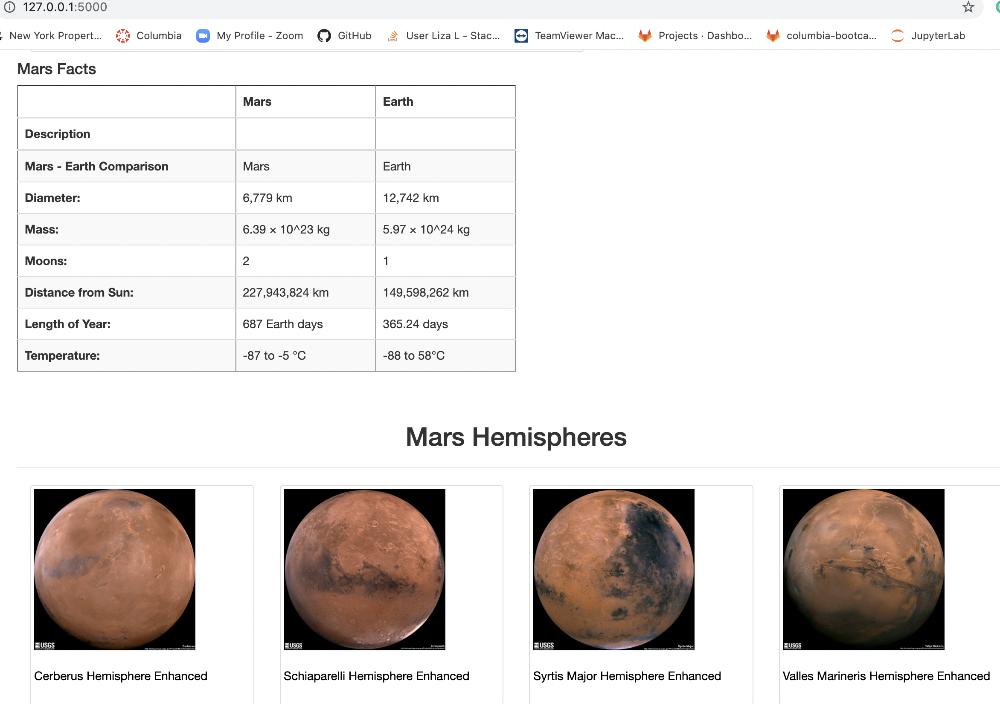

# Mission-to-Mars-

## Project Overview:

The purpose of the project is to create a web application with Flask that will automatically scrape different websites to extract data about the Mission to Mars, store in a NoSQL database and display it on a HTML page.

## Resources:
Data Sources: Mars News, Mars Featured Images, Mars Facts, Mars Hemispheres
Software: Python 3.7.7, Anaconda Navigator 1.9.12, Conda 4.8.4, Jupyter Notebook 6.0.3, MongoDB 4.4.0, Splinter 0.14.0, BeautifulSoup4 4.9.1, Flask 1.1.2, BootStrap 3.3.7

## Results:

